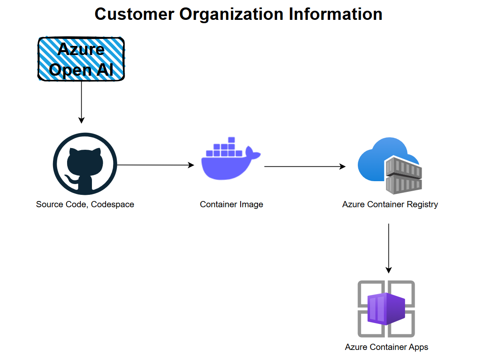

# AI Application Development using Azure OpenAI

## Resources 

- GitHub Repo https://github.dev/wrijugh/genai-application
- YouTube Playlist https://www.youtube.com/watch?v=9bbNbukPT2Y&list=PLPIVZsyfpXt8oifc9GOnWS2AsOvllIEwK


## Technologies 
- Azure OpenAI
- Docker Desktop
- Azure Container Regustry
- Azure Container Apps 

## Architecture 


## Presentation Slide
[Powerpoint Slide](AI-Apps-Dev-using-Azure-and-OpenAI.pdf)

## Instructions

### Config file
You need an `.env` file with the following values 

```bash
OPENAI_API_VERSION = "2024-07-01-preview"

AZURE_OPENAI_API_KEY = "{key}"
AZURE_OPENAI_ENDPOINT = "{endpoint url}"

AZURE_OPENAI_COMPLETION_MODEL = "gpt-35-turbo"
AZURE_OPENAI_COMPLETION_DEPLOYMENT_NAME = "gpt-35-turbo-dev"
```

The file should be put in the folder from where we will run the code. If it is placed in different location please give the specific path. 

> If you are changing any value while the jupyter notebook is loaded, you need to **restart** the kernel to reflect the changes. 

### Dependencies

You may run this command to install all the libraries

```
pip install python-dotenv streamlit langchain langchain-openai openai==1.46.0
```

### Container image Build

You need docker engine running in your dev machine. 

```
docker build -t customerweb:v1 .
```

To run it locally, run the below command. This will open a browser locally. 

```
docker run -p 8501:8501 customerweb:v1
```

### Container image push

Login to the container registry using below command. It will ask you to enter the user name and password. 

```
docker login container-registry-url
```

Once it is logged in, rename (`tag`) the local container image based on the registry you chose. Then 

```
docker push container-registry-url/customer:v1 
```

## Contact
Wriju Ghosh - https://www.linkedin.com/in/wrijughosh/